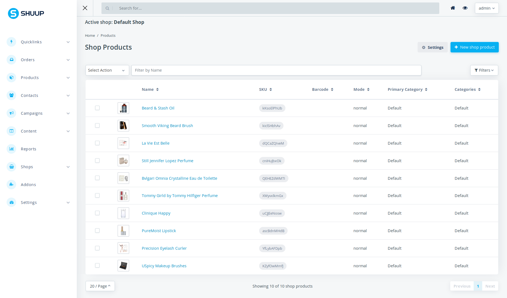
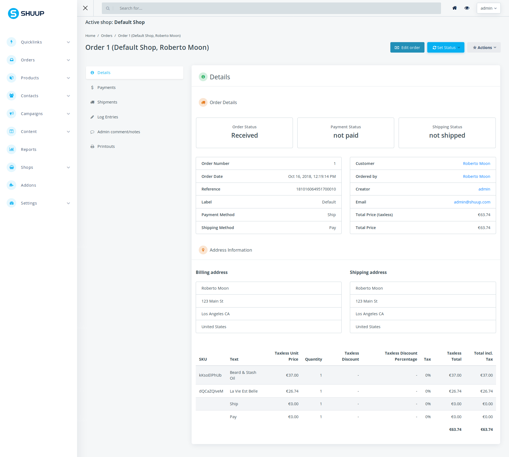

.. image:: https://travis-ci.org/shuup/shuup.svg?branch=master
    :target: https://travis-ci.org/shuup/shuup
.. image:: https://coveralls.io/repos/github/shuup/shuup/badge.svg?branch=master
   :target: https://coveralls.io/github/shuup/shuup?branch=master
.. image:: https://img.shields.io/pypi/v/shuup.svg
   :alt: PyPI
   :target: https://github.com/shuup/shuup
.. image:: https://snyk.io/test/github/shuup/shuup/badge.svg
   :alt: Known Vulnerabilities
   :target: https://snyk.io/test/github/shuup/shuup

Shuup
=====

Shuup is an Open Source E-Commerce Platform based on Django and Python.

https://shuup.com/

Copyright
---------

Copyright (c) 2012-2021 by Shoop Commerce Ltd. <support@shuup.com>

Shuup is International Registered Trademark & Property of Shoop Commerce Ltd.,
Business ID: FI27184225,
Business Address: Iso-Roobertinkatu 20-22, 00120 HELSINKI, Finland.

CLA
---

Contributor License Agreement is required for any contribution to this
project.  Agreement is signed as a part of pull request process.  See
the CLA.rst file distributed with Shuup.

License
-------

Shuup is published under Open Software License version 3.0 (OSL-3.0).
See the LICENSE file distributed with Shuup.

Some external libraries and contributions bundled with Shuup may be
published under other compatible licenses. For these, please
refer to VENDOR-LICENSES.md file in the source code tree or the licenses
included within each package.

Chat
----

We have a Gitter chat room for Shuup.  Come chat with us!  |Join chat|

.. |Join chat| image:: https://badges.gitter.im/Join%20Chat.svg
   :target: https://gitter.im/shuup/shuup

Docker quick start
------------------

Fastest way to get Shuup up and running is to use `Docker <https://www.docker.com>`_.

1. Run:

   .. code-block:: shell

      docker-compose up

2. Open `localhost:8000/sa <http://localhost:8000/sa>`_ in a browser,
   log in with username: ``admin`` password: ``admin``

Full Shuup installation guide
-----------------------------

See `Getting Started
<http://shuup.readthedocs.io/en/latest/howto/getting_started.html>`__.

For simple project example see our `Django-project template <https://github.com/shuup/shuup-project-template>`__.

Getting Started with Shuup development
--------------------------------------

See `Getting Started with Shuup Development
<http://shuup.readthedocs.io/en/latest/howto/getting_started_dev.html>`__.

Contributing to Shuup
---------------------

Interested in contributing to Shuup? Please see our `Contribution Guide
<https://www.shuup.com/contributions/>`__.

Documentation
-------------

Shuup documentation is available online at `Read the Docs
<http://shuup.readthedocs.org/>`__.

Documentation is built with `Sphinx <http://sphinx-doc.org/>`__.

Issue the following commands to build the documentation:

.. code:: sh

    pip install -r requirements-doc.txt
    cd doc && make html

To update the API documentation rst files, e.g. after adding new
modules, use command:

.. code:: sh

    ./generate_apidoc.py

Roadmap
-------

v3 (early 2021)
###############

* Initial Django 3.x support
* Latest Jinja support
* Deprecate theme folders under Shuup front which are used to override
  individual macros in macro folders. This does not work well with latest
  Jinja and adds extra complexity.

v4 (mid 2021)
#############

* Move Shuup front, xtheme and theming features to own addons. This so that
  projects not ready for updating theme or front can still get latest Shuup.
* Introduce new default theme and overhaul templates structure to be more
  simple (likely Bootstrap 5 will be used).
* Bump admin Bootstrap version to match with the new front
* Move various other not essential apps in this repository to addons for
  better version management.

OS Addons
---------

* `Django-project template <https://github.com/shuup/shuup-project-template>`__. Django-project template.

* `Shuup API <https://github.com/shuup/shuup-api>`__. Shuup API.
* `Shuup REST API <https://github.com/shuup/shuup-rest-api>`__. Shuup REST API.
* `Shuup Product Variations <https://github.com/shuup/shuup-product-variations>`__. Shuup Product Variations.
* `Shuup Product Reviews <https://github.com/shuup/shuup-product-reviews>`__. Shuup Product Reviews.
* `Shuup Stripe <https://github.com/shuup/shuup-stripe>`__. Stripe Payment Processor Addon for Shuup.
* `Shuup Wishlist <https://github.com/shuup/shuup-wishlist>`__. Shuup Wishlist Addon.
* `Shuup Checkoutfi <https://github.com/shuup/shuup-checkoutfi>`__. Checkout.fi integration for Shuup.
* `Shuup Yaml <https://github.com/shuup/shuup-yaml>`__. Import categories, manufacturers and products to Shuup.
* `Shuup Mailchimp <https://github.com/shuup/shuup-mailchimp>`__. Mailchimp integration for Shuup (New v0.7.8 released).
* `Shuup Xtheme Layouts <https://github.com/shuup/shuup-xtheme-extra-layouts>`__. Xtheme layouts for Shuup.
* `Shuup Category Organizer <https://github.com/shuup/shuup-category-organizer>`__. Shuup Category Organizer.
* `Shuup Logging <https://github.com/shuup/shuup-logging>`__. Shuup Logging.

The purpose of these addons, is to demonstrate how to build
other simple addons to extend Shuup. To learn more, here are
some useful links about how to extend Shuup.

* `Provides system <https://shuup.readthedocs.io/en/latest/ref/provides.html>`__.
* `Core settings <https://shuup.readthedocs.io/en/latest/api/shuup.core.html#module-shuup.core.settings>`__.
* `Front settings <https://shuup.readthedocs.io/en/latest/api/shuup.front.html#module-shuup.front.settings>`__.
* `Admin settings <https://shuup.readthedocs.io/en/latest/api/shuup.admin.html#module-shuup.admin.settings>`__.
* `Extending Shuup <https://shuup.readthedocs.io/en/latest/#extending-shuup>`__.

Admin Preview
-------------

